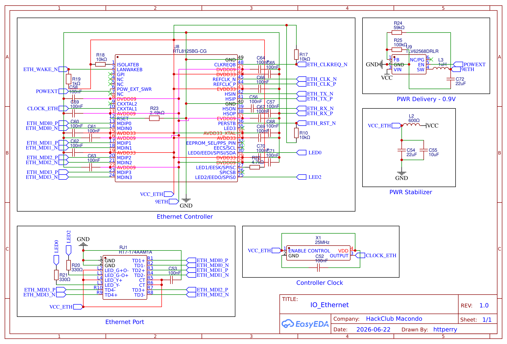

[← Back to IO Connections](../README.md) · [← Back to Schematics](../../README.md) · [← Back to Root](../../../README.md)

# IO — Ethernet (2.5GbE)

**Revision 1.0** — Drawn by httperry · HackClub Macondo · 2026-06-22

---

## Schematic

## Downloads

| File | Description |
|---|---|
| [Schematic_Atlas_2026-06-22.png](./Schematic_Atlas_2026-06-22.png) | Schematic export (PNG) |
| [Schematic_Atlas_2026-06-22.svg](./Schematic_Atlas_2026-06-22.svg) | Schematic export (SVG) |
| [Schematic_Atlas_2026-06-22.pdf](./Schematic_Atlas_2026-06-22.pdf) | Schematic export (PDF) |
| [SCH_μAtlas_2026-06-22.json](./SCH_%CE%BCAtlas_2026-06-22.json) | EasyEDA source (JSON) |
| [IO_Ethernet.schdoc](./IO_Ethernet.schdoc) | Schematic document |
