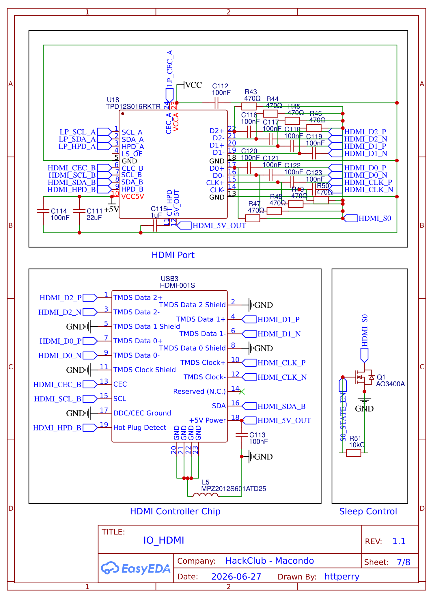

[← Back to IO Connections](../README.md) · [← Back to Schematics](../../README.md) · [← Back to Root](../../../README.md)

# IO — HDMI

**Revision 1.1** — Drawn by httperry · HackClub Macondo · 2026-06-27

---

## Schematic

## Downloads

| File | Description |
|---|---|
| [Schematic_Atlas_2026-06-27.png](./Schematic_Atlas_2026-06-27.png) | Schematic export (PNG) |
| [Schematic_Atlas_2026-06-27.svg](./Schematic_Atlas_2026-06-27.svg) | Schematic export (SVG) |
| [Schematic_Atlas_2026-06-27.pdf](./Schematic_Atlas_2026-06-27.pdf) | Schematic export (PDF) |
| [SCH_μAtlas_2026-06-27.json](./SCH_%CE%BCAtlas_2026-06-27.json) | EasyEDA source (JSON) |
| [IO_HDMI.schdoc](./IO_HDMI.schdoc) | Schematic document |
