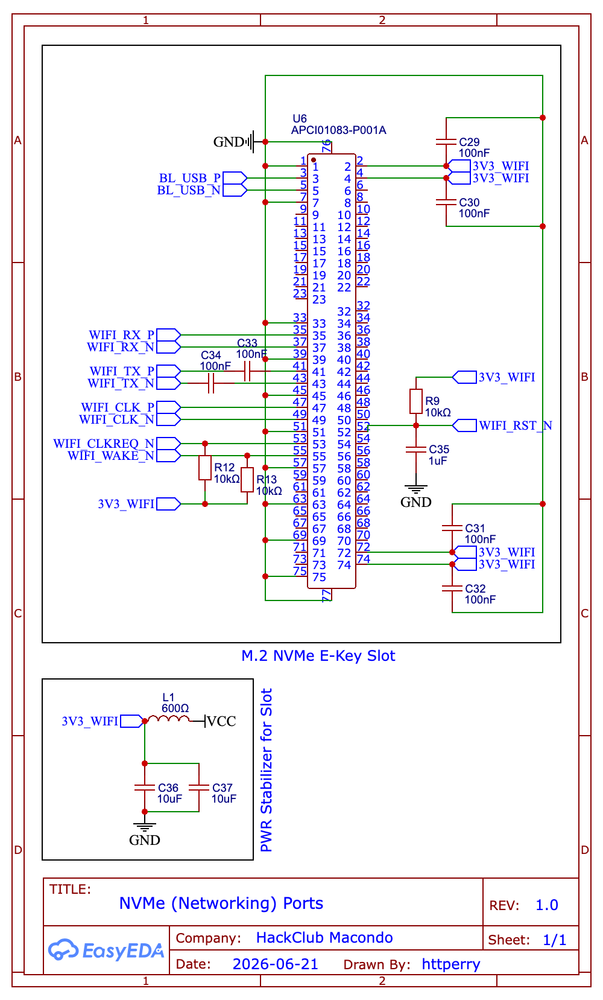

[← Back to NVMe Connections](../README.md) · [← Back to Schematics](../../README.md) · [← Back to Root](../../../README.md)

# NVMe — Networking (M.2 E-Key)

**Revision 1.0** — Drawn by httperry · HackClub Macondo · 2026-06-21

---

## Schematic

## Downloads

| File | Description |
|---|---|
| [Schematic_μAtlas_2026-06-21.png](./Schematic_%CE%BCAtlas_2026-06-21.png) | Schematic export (PNG) |
| [Networking.svg](./Networking.svg) | Schematic export (SVG) |
| [Networking.pdf](./Networking.pdf) | Schematic export (PDF) |
| [SCH_μAtlas_2026-06-21.json](./SCH_%CE%BCAtlas_2026-06-21.json) | EasyEDA source (JSON) |
| [NVMe_(Networking)_Ports.schdoc](./NVMe_(Networking)_Ports.schdoc) | Schematic document |