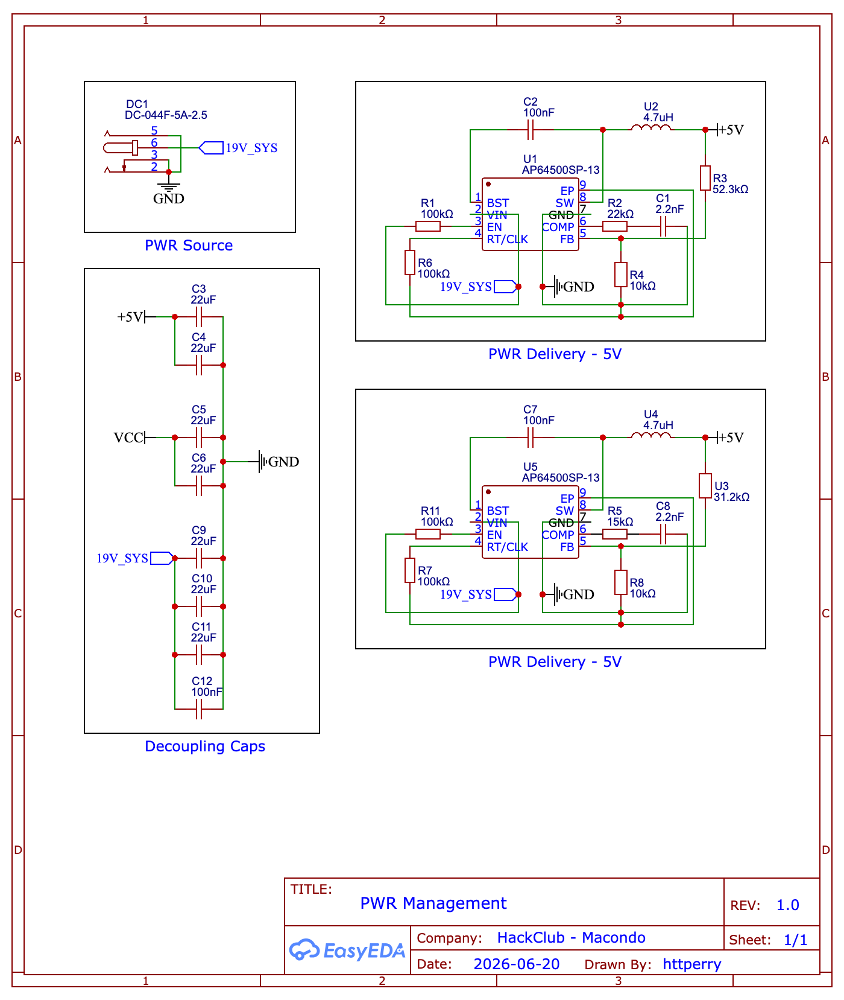

[← Back to Schematics](../README.md) · [← Back to Root](../../README.md)

# PWR Management

**Revision 1.0** — Drawn by httperry · HackClub Macondo · 2026-06-20

---

## Schematic

## Downloads

| File | Description |
|---|---|
| [PWR_Management.png](./PWR_Management.png) | Schematic export (PNG) |
| [PWR Management.svg](./PWR%20Management.svg) | Schematic export (SVG) |
| [PWR Management.pdf](./PWR%20Management.pdf) | Schematic export (PDF) |
| [SCH_μAtlas_2026-06-21.json](./SCH_%CE%BCAtlas_2026-06-21.json) | EasyEDA source (JSON) |
| [PWR_Management_2026-06-21.schdoc](./PWR_Management_2026-06-21.schdoc) | Schematic document |
