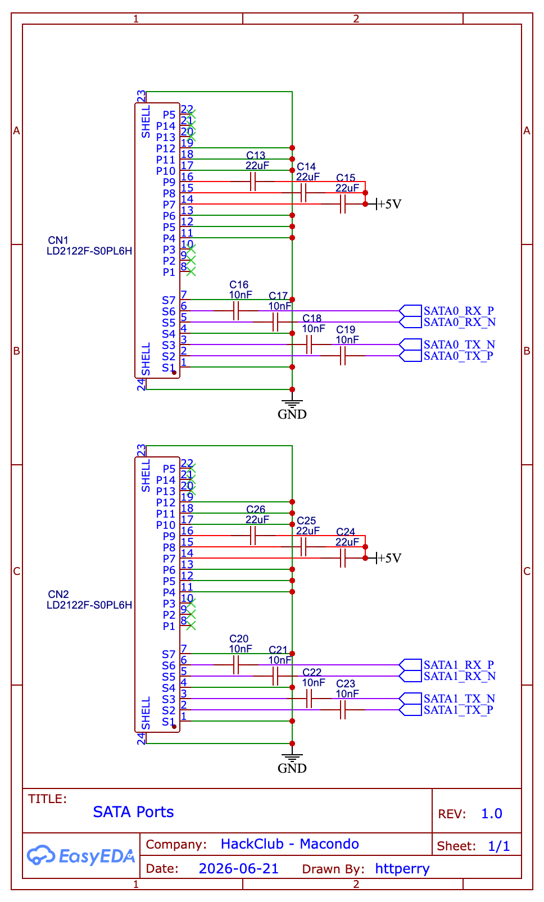

[← Back to Schematics](../README.md) · [← Back to Root](../../README.md)

# SATA Connections

**Revision 1.0** — Drawn by httperry · HackClub Macondo · 2026-06-21

---

## Schematic

## Downloads

| File | Description |
|---|---|
| [Schematic_μAtlas_2026-06-21.png](./Schematic_%CE%BCAtlas_2026-06-21.png) | Schematic export (PNG) |
| [SATA Ports.svg](./SATA%20Ports.svg) | Schematic export (SVG) |
| [SATA Ports.pdf](./SATA%20Ports.pdf) | Schematic export (PDF) |
| [SCH_μAtlas_2026-06-21.json](./SCH_%CE%BCAtlas_2026-06-21.json) | EasyEDA source (JSON) |
| [SATA Ports.schdoc](./SATA%20Ports.schdoc) | Schematic document |
